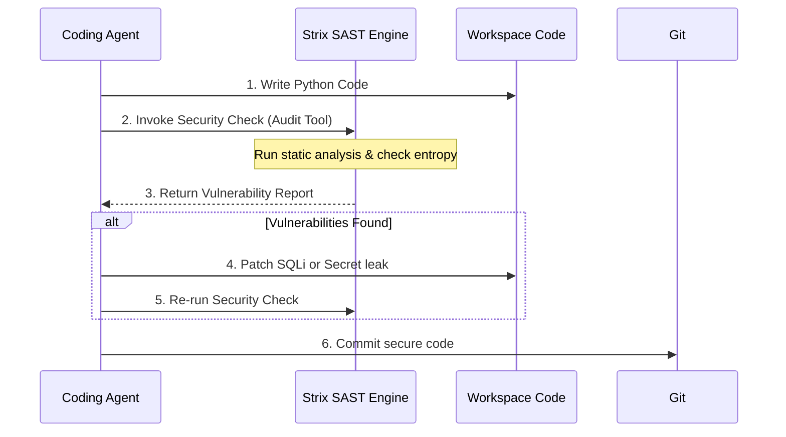

# Advanced Capabilities: Skyvern & Strix Integration Pathways

This document outlines the design, architecture, and integration pathways to mount **Skyvern** (Visual Browser Automation) and **Strix** (Local Code Security & Pentest Auditor) as specialized agent tools inside the Jarvis containerized network.

---

## 1. Visual Browser Automation (Skyvern)

### Overview
[Skyvern](https://github.com/Skyvern-AI/Skyvern) replaces traditional CSS-selector-based scraping (Playwright/Selenium) by utilizing computer vision and LLMs to interact with websites. This allows Jarvis to handle complex visual interfaces, CAPTCHAs, and dynamic flows.

### Architecture Mapping
Skyvern will run as a service inside the Jarvis Docker Compose environment, sharing the virtual bridge network.

```mermaid
graph TD
    subgraph Host Network
        Client[Client Browser / Port 3000]
    end
    subgraph Docker Network (jarvis_default)
        Jarvis[jarvis_app]
        Ollama[jarvis_ollama]
        Skyvern[skyvern_service]
    end
    Jarvis -- 1. Submit Navigation Task --> Skyvern
    Skyvern -- 2. Query Visual Layout --> Ollama
    Skyvern -- 3. Execute Actions on Web --> WWW[Internet]
    Skyvern -- 4. Return Scraped Markdown --> Jarvis
    Client -- View Skyvern UI --> Skyvern
```

### Docker Compose Configuration
Add the following service configuration block to `docker-compose.yml`:
```yaml
  skyvern:
    image: skyvern/skyvern:latest
    container_name: jarvis_skyvern
    ports:
      - "3000:3000"
    environment:
      - OPENAI_API_KEY=${OPENAI_API_KEY}
      - OLLAMA_BASE_URL=http://ollama:11434
    depends_on:
      - ollama
```

### CrewAI Tool Implementation
Jarvis wraps the Skyvern API inside a standard tool. The agent triggers navigation by posting a JSON payload to the Skyvern Task Endpoint.

```python
import time
import requests
from crewai.tools import tool


@tool("Skyvern Visual Browser Tool")
def skyvern_browser_action(url: str, instruction: str) -> str:
    """
    Automates web browser interactions using computer vision.
    Use this to scrape dynamic websites or navigate pages with complex layouts.
    """
    skyvern_url = "http://skyvern:3000/api/v1/tasks"
    payload = {"url": url, "navigation_goal": instruction}

    try:
        response = requests.post(skyvern_url, json=payload, timeout=30)
        response.raise_for_status()
        task = response.json()
        task_id = task["task_id"]

        # Poll for completion
        while True:
            status_resp = requests.get(f"{skyvern_url}/{task_id}")
            status_data = status_resp.json()
            if status_data["status"] == "COMPLETED":
                return status_data["extracted_markdown"]
            elif status_data["status"] == "FAILED":
                return f"Skyvern navigation task failed: {status_data['error_message']}"
            time.sleep(2)
    except Exception as e:
        return f"Failed to connect to Skyvern: {e}"
```

---

## 2. Local Code Security Auditing (Strix)

### Overview
**Strix** acts as a sandboxed static application security testing (SAST) and vulnerability scanner. When writing code, Jarvis can execute Strix to verify that the generated code contains no SQL injections, hardcoded API secrets, or outdated dependencies.

### Integration Pipeline
The agent runs Strix dynamically inside the sandbox prior to committing any code.



### Docker Integration
Strix is packaged as a utility inside the `jarvis_app` Docker image. The tools are installed during the build process:
```dockerfile
# Dockerfile additions for Strix tools (such as Bandit, Semgrep, and TruffleHog)
RUN pip install bandit semgrep
RUN curl -sSfL https://raw.githubusercontent.com/trufflesecurity/trufflehog/main/scripts/install.sh | sh -s -- -b /usr/local/bin
```

### CrewAI Tool Implementation
Jarvis wraps the scanner execution in a tool that checks Python files and scans for secret leaks.

```python
import subprocess
from crewai.tools import tool


@tool("Strix Code Security Audit")
def strix_security_audit(target_dir: str) -> str:
    """
    Scans a workspace directory for security vulnerabilities, hardcoded secrets, and SQL injections.
    Use this to audit code security before committing changes.
    """
    # 1. Scan for hardcoded API keys and secrets using TruffleHog
    secrets_cmd = [
        "trufflehog",
        "filesystem",
        target_dir,
        "--only-verified",
        "--json",
    ]
    # 2. Scan Python files for security flaws using Bandit
    sast_cmd = ["bandit", "-r", target_dir, "-f", "txt"]

    report = []

    # Run SAST scanner
    try:
        sast_res = subprocess.run(sast_cmd, capture_output=True, text=True)
        report.append("=== Bandit Static Analysis ===")
        report.append(sast_res.stdout)
    except Exception as e:
        report.append(f"SAST analysis failed to start: {e}")

    # Run Secrets scanner
    try:
        sec_res = subprocess.run(secrets_cmd, capture_output=True, text=True)
        report.append("\n=== TruffleHog Secrets Analysis ===")
        if sec_res.stdout.strip():
            report.append(sec_res.stdout)
        else:
            report.append("No leaked secrets or API credentials found.")
    except Exception as e:
        report.append(f"Secrets analysis failed to start: {e}")

    return "\n".join(report)
```
